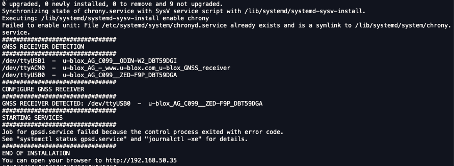
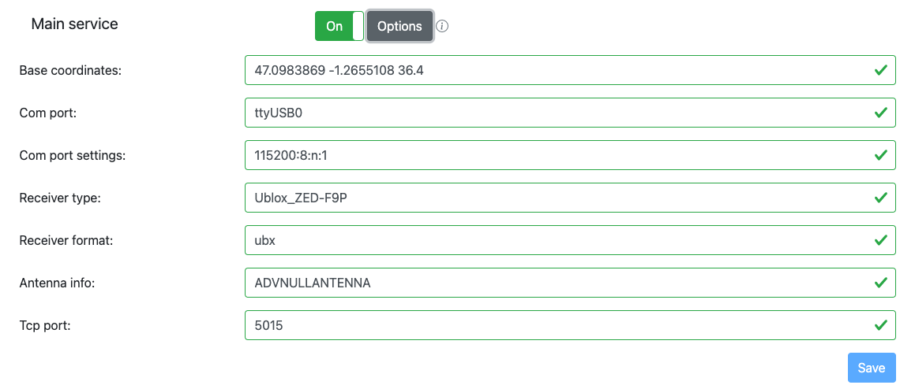

## Release 08.04
```text
- 0. gnss configuration
-- 윈도우 ucenter에서 Port, Rate, 변경후 Configuration 저장
-- 재부팅후 8hz로 동작되는지 확인 
- 1. base station
-- system service로 인해 docker container는 불가, lcd, master만 실행 
-- system service는 RTK 오픈소스의 rtkbase_web.service 기본 실행
-- 진행
https://github.com/zetabank-autonomous/docker_dev.git  -b rpi
cd lcd
cat Dockerfile: zetabankhub/rtk:melodic-lcd-v0.0.3 
cd lcd/basestation: README.md 확인
git@github.com:zetabank-rm/docker.git  -b rpi
docker compose up lcd 만 실행

- 2. rover
-- 

```
## install
- ubuntu 22.04
- hide top bar
  - sudo apt install gnome-shell-extension-prefs
- of.sh, python3.9.sh 설치
- ros1.sh 미설치 
- 선행 작업
  - python3.9
  - cp of.sh ~/
  - cp python3.0 ~/
- sudo apt install cmake
- of/3rdparty
- install libzmq in 3rdparty
- 또는 sudo apt update && sudo apt install libzmq3-dev
```bash
RUN mkdir -p /of/3rdparty
RUN cd /of/3rdparty && git clone https://github.com/zeromq/libzmq.git -b master && \
    cd libzmq && \
    mkdir build && \
    cd build && \
    cmake .. && \
    make -j4 && make install
    
# install cppzmq in 3rdparty
RUN cd /of/3rdparty && git clone https://github.com/zeromq/cppzmq.git -b master && \
    cd cppzmq && \
    mkdir build && \
    cd build && \
    cmake .. && \
    make -j4 && make install
```
- sudo python3 -m pip install zmq
- sudo apt install net-tools
## base station
1. https://github.com/jancelin/pi-gen_RTKbase/releases/tag/BaseGNSS-RPi-2.3.4
2. Download RTKBaseGNSS_2_3_4.zip
3. Flashing
   ```bash
    ssh basegnss@192.168.50.35
    mdp: basegnss!
   ```
4. https://github.com/Stefal/rtkbase
  ```bash
  $ cd ~
  $ wget https://raw.githubusercontent.com/Stefal/rtkbase/master/tools/install.sh -O install.sh
  $ chmod +x install.sh
  $ sudo ./install.sh --all
  ```

6. http://192.168.50.35
* password: admin

   
## LTE Router
* http://192.168.50.1/home.asp
* model: IRP-400W
* 암호: 상단에 부착됨

## permission error
* /dev/ttyUSB0
* udevadm info -a -n <현재 잡힌 포트 (ex. /dev/ttyACM0)>
* https://coding-robot.tistory.com/9

## mapviz
```bash
roslaunh mapviz mapviz.launch
```
* 사용법
  * https://hm02123.tistory.com/13
  * https://hm02123.tistory.com/8


## review
* 모든것의 시작: https://github.com/Stefal/rtkbase
  * 설치 방법 두가지가 있음.
      * Ready to flash release: 최신 Stefal/rtkbase가 적용된 rpi os(2022-04-04-raspios-bullseye) image와 image를 만드는 방법
      * Easy installation: rpi os와 상관없이 수동 설치 방법
  * 실험적으로 Easy installation 방법으로 함.
    * https://www.waveshare.com/wiki/7inch_DSI_LCD_(C) 사용하려면
    * 2022-01-28-raspios-bullseye-arm32 image를 사용해서 해보기로 했음
      * 2022-01-28-raspios-bullseye-arm32 설치
      * https://github.com/Stefal/rtkbase.git 다운
      * wget https://raw.githubusercontent.com/Stefal/rtkbase/master/tools/install.sh -O install.sh 실행
  
## gnss rover
```text
========================================================
RTK GNSS 모듈: F9P
https://www.devicemart.co.kr/goods/view?no=14035222

Driver:
https://github.com/KumarRobotics/ublox

Ntrip Client:
https://github.com/LORD-MicroStrain/ntrip_client

MapViewer
https://github.com/swri-robotics/mapviz

대략적인 설명입니다. 
모듈은 f9p입니다 첨부된 링크 참고 바랍니다. 
그렇게 구매 하시고 
윈도우에서 ublox u-center 앱 다운받아 확인 해보시고 
ubuntu 18.04 notebook에 USB 연결해서 사용하시면 됩니다. 
driver 설치하시고 관련 토픽이 잘 나오는지 확인하시고 
ntrip client 설치하시고 국토지리원 가셔서 등록하시고 정보 받아 입력하시면 됩니다. 
bagging된 위성데이터를 확인할때 mapviz 확인해보시고 
ntrip client 실행시와 미실행시 데이터를 확인해보시면 될것 같습니다. 
이상입니다.
최병철 드림
========================================================
```

## mapviz
```bash
cd mapviz
git checkout -b 802ed 802ed2c324379967f6ae4ba590e2fd4225e75694
```

## /etc/udev/rules.d ublox 등록
```bash
udevadm info -a -n <현재 잡힌 포트 (ex. /dev/ttyACM0)> | grep serial
udevadm info -a -n <현재 잡힌 포트 (ex. /dev/ttyACM0)> | grep idVendor
sudo udevadm control --reload-rules
# /etc/udev/rules.d/88-ublox.rules
SUBSYSTEMS=="usb", ATTRS{idVendor}=="1546", ATTRS{idProduct}=="0502", ATTRS{serial}=="DBT59CU5", SYMLINK+="ublox", MODE="666"
```

## u-center
- https://content.u-blox.com/sites/default/files/2022-09/u-centersetup_v22.07.zip
- baudrate: 460800 (default)
- 측위 1hz (default)
- ucenter에서 변경 가능함
  - ucenter -> View -> Configuration View -> RATE(rates) -> Measurement Period 1000ms -> 125ms
  - ucenter -> View -> Configuration View -> PRT(Ports) -> Baudrate 460800
  - ucenter -> View -> Configuration View -> CFG(Configuration) Save current configuration 확인 
  - ucenter에서 COMxx 설정후 모니터 확인
  - https://github.com/ros-agriculture/ntrip_ros 다덜 이걸쓰네
  - https://velog.io/@swooeun/ROS-Ublox-ZED-F9P-RTK-UTM 여기 참고


## ref
- https://github.com/Francklin2/RTKLIB_Touchscreen_GUI
- https://github.com/tomojitakasu/RTKLIB
## rules 등록
- usb2serial
  - sudo ./rules.sh
## start

```bash
sudo systemctl stop rtkbase_web.service
cd ~/rtkbase/tools/rtkbase/web_app
sudo python3 -m pip install zmq
``` 
- portforward
  - 8022 -> 22
  - 8080 -> 8080
  - http://223.171.144.22:8080/
  - http://192.168.50.101:8080/

- detect usb gnss
```bash
cd tools && ./install.sh --detect-usb-gnss
Installation options:  --detect-usb-gnss
################################
GNSS RECEIVER DETECTION
################################
/dev/ttyUSB1  -  u-blox_AG_C099__ODIN-W2_DBT59CUD
/dev/ttyACM0  -  u-blox_AG_-_www.u-blox.com_u-blox_GNSS_receiver
/dev/ttyUSB0  -  u-blox_AG_C099__ZED-F9P_DBT59CU5
```
- diagnostics
```bash
sudo systemctl stop rtkbase_web.service
cd web_app && sudo python3 server.py
```